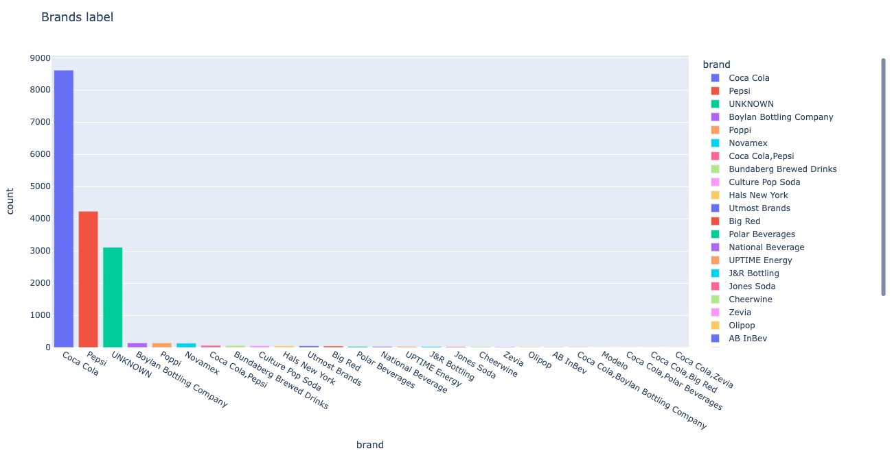

- [1. Natural Language Processing](#1-natural-language-processing)
- [2. Solution description](#2-solution-description)
  - [2.1. Initial considerations](#21-initial-considerations)
  - [2.2. Regex dict](#22-regex-dict)
  - [2.3. Reading data](#23-reading-data)
  - [2.4. Match logic](#24-match-logic)
  - [2.5. Saving results](#25-saving-results)
- [3. References](#3-references)

# 1. Natural Language Processing
The objective of this code is to create a working example of NLP using Python.

The task is to label text (when possible) with a beverage brand name based on the description provided.
The dataset consists of a CSV file with ~17k different descriptions, around 14k of which were labeled.

# 2. Solution description
The solution presented was selected based on the type of problem to be sold and several considerations were taken.
As part of the solution, an interactive plot is included to show the number of classified brands. This plot allows the user to explore the results with drag, select, scroll and zoom options from an [HTML file](report.html).

## 2.1. Initial considerations
Given that companies own several brands of beverages, the labels used refer to those brands, e.g. Coca Cola owns the brand 7up and Sprite, hence either of those are labeled as Coca Cola.
This scope allows to tag with multiple brands if are present in the text.
There are some cases where no label can be used as text contains no information of it, these cases are tagged as UNKNOWN.
Regex is used since it is a power tool and the use case for this example fits well.

## 2.2. Regex dict
First a dictionary is defined with the brand as key and its matching regex as value. This is used to iterate over each row.
For example the brand Coca Cola results in the following:

`'Coca Cola': '.*co[ck][aeo].*|.*sprite.*'`

This will match text like `'coke', 'coca', 'coka', 'sprite'` and with this catchin all combinations and possible misspelling.

## 2.3. Reading data
Once the regex is constructed the data is read using pandas as this will allow us to manipulate it easily.

|`item_name`|
|---|
||Bottle Coke Classic 20oz
|Bottle Coke Diet 20oz|
|20oz Fountain Beverage|
|Bottle Pepsi 20oz|
|...|

## 2.4. Match logic
Given this, there are 2 possible cases to label the product:

1. The product is labeled for the first time.
2. The product has been previously labeled.

When there's a regex match, if the product is labeled for the first time, the a label will be assigned, otherwise, the label will be concatenated with the current and matching labels. This results in finding multiple brands in a product.

## 2.5. Saving results
After all rows are checked, the results are grouped, aggregated and counted per brand to visually inspect them, finally, results are also saved as csv with assigned labels.

# 3. References
To obtain the company names and classify labels the following references were used:

  - https://diamondknot.com/
  - https://en.wikipedia.org/wiki/List_of_brand_name_soft_drink_products#Coca-Cola_Company
  - https://en.wikipedia.org/wiki/Jarritos
  - https://en.wikipedia.org/wiki/Big_Red_(soft_drink)
